# Clue

AI Efficiency Index for Engineering Teams.

Get scored 0-100 on how efficiently you use AI coding tools. Track tokens, costs, tool usage across every project. Receive actionable recommendations. Share anonymised metrics with your team. Currently supports [Claude Code](https://claude.com/claude-code), with more providers planned.

Python 3.10+. SQLite for storage. Streamlit + Plotly dashboard.

---

## Quick Start

### Option A: mise + uv (recommended for developers)

```bash
git clone https://github.com/lhuria94/clue.git && cd clue
mise install          # installs Python 3.14 + uv
uv sync --group dev   # reproducible install from lockfile
task setup            # test + extract + hook + doctor
```

Requires [mise](https://mise.jdx.dev) (`curl https://mise.jdx.dev/install.sh | sh`).

### Option B: macOS / Linux (no prerequisites beyond Python)

```bash
git clone https://github.com/lhuria94/clue.git && cd clue && ./setup.sh
```

### Option C: Windows (PowerShell)

```powershell
# If needed first: Set-ExecutionPolicy -Scope CurrentUser RemoteSigned
git clone https://github.com/lhuria94/clue.git; cd clue; .\setup.ps1
```

### What setup does

| Step | What happens | Automated? |
|------|-------------|------------|
| 1 | Detects Python 3.10+ (or tells you exactly how to install it) | Yes |
| 2 | Creates `.venv/` virtual environment | Yes |
| 3 | Installs `clue` + dev tools into venv | Yes |
| 4 | Offers to install [Taskfile](https://taskfile.dev) for shortcuts (optional) | Prompted |
| 5 | Runs 232-test suite to verify everything works | Yes |
| 6 | Extracts all your Claude Code data from `~/.claude/` | Yes |
| 7 | Installs PostStop hook for continuous auto-capture | Yes |
| 8 | Prints your AI Efficiency Score with recommendations | Yes |
| 9 | Runs `doctor` to validate all prerequisites | Yes |

---

## Prerequisites

| Prerequisite | Required? | How to install | Verified by |
|---|---|---|---|
| **Python 3.10+** | Required | `brew install python@3.12` (macOS), `sudo apt install python3.12 python3.12-venv` (Ubuntu), `winget install Python.Python.3.12` (Windows) | `setup.sh`, `doctor` |
| **Python venv** | Required | Included with Python on macOS/Windows. Ubuntu: `sudo apt install python3-venv` | `setup.sh`, `doctor` |
| **Python sqlite3** | Required | Included in Python stdlib on all platforms | `doctor` |
| **Claude Code** | Required | `npm install -g @anthropic-ai/claude-code` — use it at least once | `doctor` |
| **Git** | Optional | For cloning. Or download the zip | `doctor` |
| **mise** | Optional | `curl https://mise.jdx.dev/install.sh \| sh` — manages Python + uv versions | `.mise.toml` |
| **uv** | Optional | Installed by mise, or `curl -LsSf https://astral.sh/uv/install.sh \| sh` | `.mise.toml` |
| **Taskfile** | Optional | `brew install go-task` (macOS), `winget install Task.Task` (Windows), [taskfile.dev](https://taskfile.dev/installation/) | `doctor` |

`python -m clue doctor` checks all of these and tells you exactly what's missing and how to fix it.

---

## Tech Stack

| Layer | Technology | Why this choice |
|---|---|---|
| **Language** | Python 3.10+ | Available on every OS. No compile step. Stdlib-only means zero `pip install` failures |
| **Storage** | SQLite (WAL mode) | Stdlib. Single-file. No server. Concurrent reads during hook writes. Scales to 500K+ rows locally |
| **Schema** | Versioned migrations | `db.py` runs numbered migrations on startup. Add columns without breaking existing databases |
| **Watermarks** | SQLite table | File mtimes tracked per-source. Incremental extraction only re-parses changed files |
| **Dashboard** | Streamlit + Plotly | Interactive, auto-refreshing, live SQLite queries, native dark/light theme |
| **Scoring** | Python weighted composite | 7 weighted + 1 informational dimensions, 0-100 per dimension, weighted average. Deterministic, no ML |
| **Hook** | Claude Code PostStop | Fires after every session. Runs incremental extract in background. Zero config after setup |
| **Team sharing** | JSON export + merge | Each user exports locally. Merge command combines. No shared infrastructure |
| **Privacy** | `--scrub` flag | Strips all prompt text from exports. Aggregated metrics only. No absolute paths in dashboard |
| **Tests** | pytest | 232 tests across unit, integration, security, and CLI layers |
| **Task runner** | Taskfile (optional) | Shortcuts for common operations. Falls back to `python -m clue` if not installed |
| **Cross-platform** | `pathlib` + platform detection | Windows backslash path encoding, PowerShell setup script, platform-aware doctor |

---

## Commands

With Taskfile:

```bash
task setup              # Full bootstrap (first time)
task start              # Open interactive dashboard (PORT=8486 task start)
task stop               # Stop the running dashboard
task score              # Print efficiency score
task test               # Run test suite
task export             # Export for team (scrubbed)
task doctor             # Validate prerequisites
task extract-incremental # Extract only new data
task                    # List all tasks
```

Without Taskfile:

```bash
.venv/bin/python -m clue setup
.venv/bin/python -m clue dashboard
.venv/bin/python -m clue score
.venv/bin/python -m clue doctor
.venv/bin/python -m clue extract --incremental
.venv/bin/python -m clue export --scrub --user-label "alice"
.venv/bin/python -m clue merge alice.json bob.json -o team.json
```

---

## AI Efficiency Score

Every user gets scored **0-100** across 7 weighted dimensions + 1 informational:

| Dimension | Weight | What it measures | Score drivers |
|---|---|---|---|
| **Prompt Quality** | 20% | Are prompts specific and context-rich? | Length distribution, slash commands, file references, confirmation rate |
| **Cost Efficiency** | 15% | Consistent spend per session? | Cost-per-session distribution, spread (p90/median), concentration (top 10% share) |
| **Wasted Spend** | 10% | How much rework costs you? | Correction rate, estimated cost of AI responses after corrections |
| **Tool Mastery** | 15% | Using tools effectively? | Diversity, Read→Edit workflow, per-session tool mix, antipatterns |
| **Session Discipline** | 10% | Focused, structured sessions? | Depth range (5-40), tool workflow structure |
| **Cost Awareness** | 10% | Right model for the task? | Model mix across Opus/Sonnet/Haiku tiers |
| **Iteration Efficiency** | 20% | Converging on results quickly? | Correction rate, AI leverage, structured workflows |
| **Advanced Usage** | 0% | Leveraging advanced features? | Agent types, parallel execution, skill adoption, task discipline (informational) |

### Example output

```
AI Efficiency Score: 76/100  [B]  -16.6%

Dimension Scores:
Prompt Quality            50   D   20%   Avg 59 chars, 38% in ideal range, 12% with file refs
Cost Efficiency           85   A   15%   Median $0.42/session, p90/median spread: 1.8x
Wasted Spend             78   B   10%   4% correction rate, $12.30 wasted on rework
Tool Mastery              90   A   15%   20 tools used, avg 4.2 tools/session
Session Discipline        46   D   10%   41% sessions <3 prompts, 60% structured
Cost Awareness            81   B   10%   Sonnet 93%, Opus 3%, Haiku 4%
Iteration Efficiency      72   B   20%   4% corrections, 2.8x AI leverage

Recommendations:
1. Your most efficient sessions stay under 18 AI steps — keep tasks focused.
2. Include context in prompts: what file, what behaviour, what you expect.
3. Start fresh sessions for new tasks — long sessions degrade quality.
```

---

## Dashboard

Streamlit + Plotly dashboard served at `http://127.0.0.1:8484`:

### Score Overview

Cost-first hero with estimated spend, cost per session, and correction waste. Efficiency score with all 7 dimensions, trend indicator, and top actionable recommendations. KPI cards show totals at a glance.

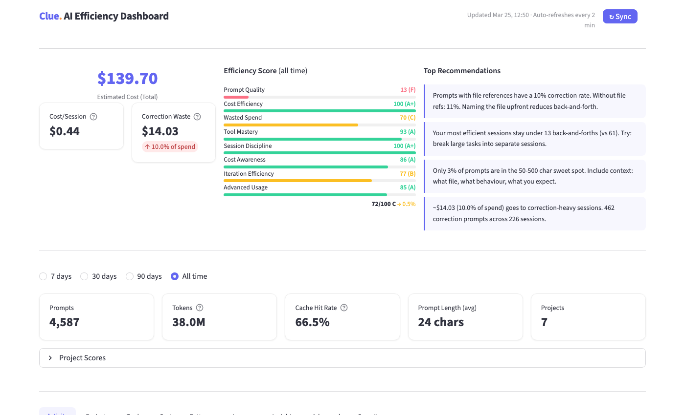

KPI row with prompts, tokens, cache hit rate, average prompt length, and project count — all filtered by the selected date range.

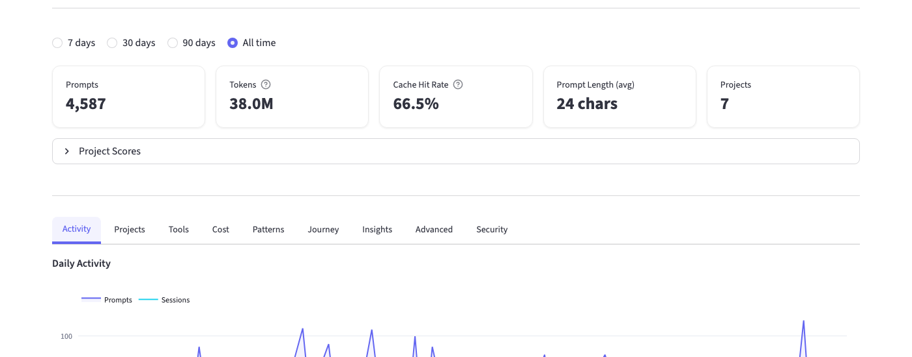

### Activity

Daily prompts, sessions, token consumption (input/output/cache), and prompt length distribution over time. Filter by date range to spot trends.

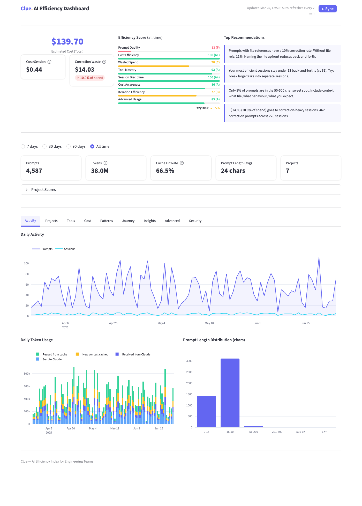

### Projects

Per-project breakdown of prompts and tokens. See which repos consume the most AI resources.

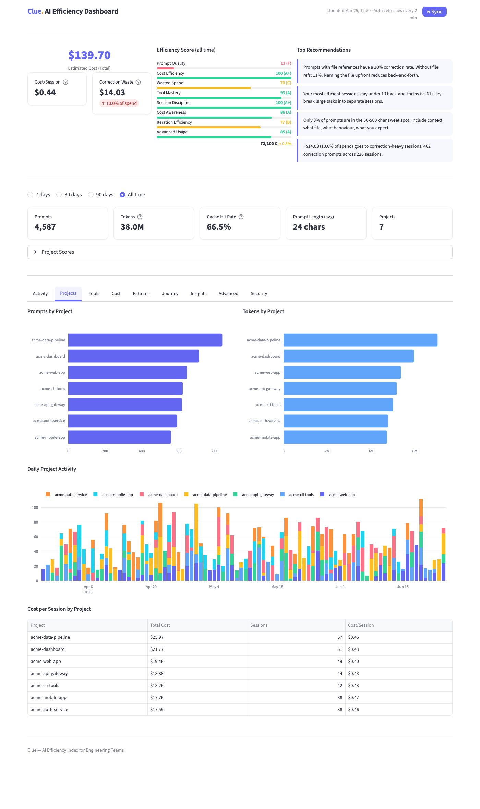

### Tools

Top 15 tools by usage count with daily tool usage trends. Stop reason analysis shows why sessions end (tool_use, end_turn, stop_sequence). Agentic usage breakdown shows sub-agent turns and cost vs main conversation.

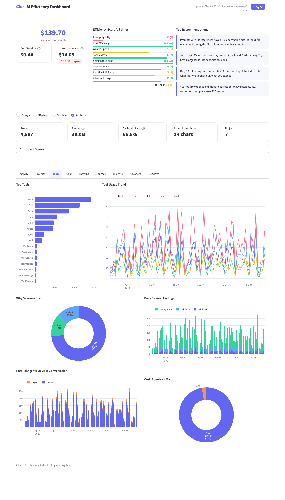

### Cost

Model distribution doughnut chart with daily cost breakdown by model. Track spend across Opus, Sonnet, and Haiku.

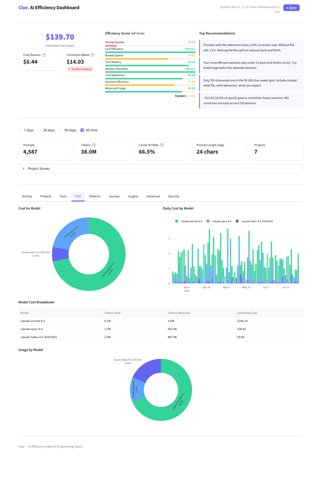

### Patterns

Hour-of-day and day-of-week distributions reveal your productivity rhythms. Git branch activity shows where work happens.

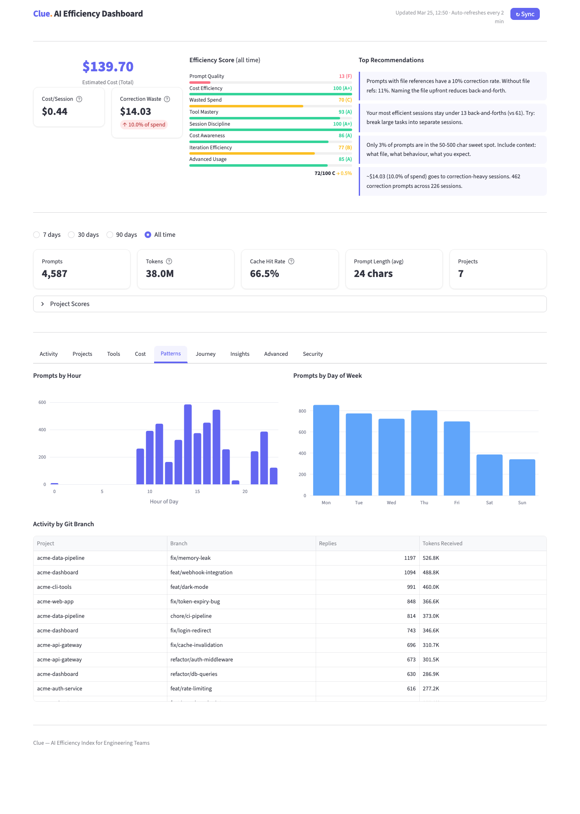

### Journey

Developer journey view — usage streak, week-over-week comparison, GitHub-style activity heatmap, session depth distribution, iteration efficiency trend, weekly summaries, and recent session timeline.

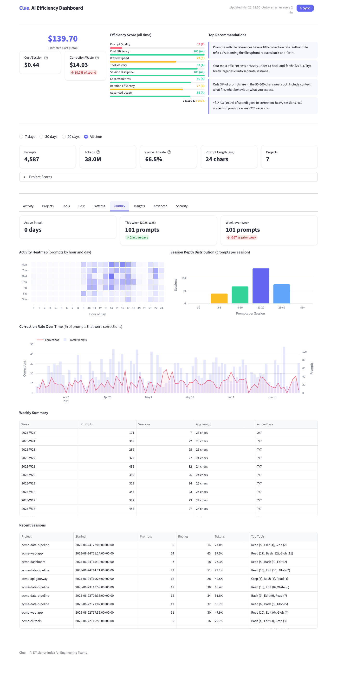

### Insights

Advanced analytics — weekly digest with correction rate trends, cheapest vs costliest sessions comparison, per-project coaching with outlier warnings, prompt learning (what patterns correlate with efficiency), expensive sessions table (top 20 by cost), time-of-day correction rate analysis, branch coaching (correction rate and cost per git branch), and team percentile benchmarks (when merged JSON available).

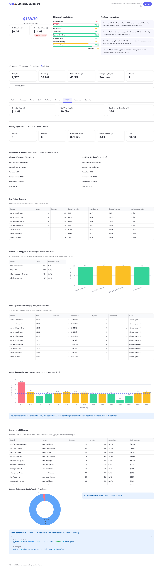

### Advanced

Agentic maturity metrics — agent type distribution (researcher, reviewer, debugger, etc.), skill adoption (commit, review, test), task tool usage (TaskCreate, TaskUpdate), parallel execution patterns. Daily trend chart tracks advanced feature adoption over time.

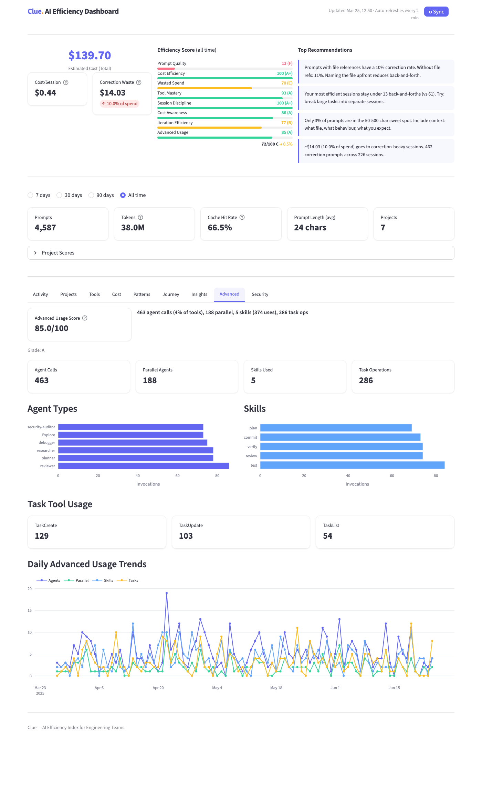

### Security

AI usage security posture — risk score (0=clean), finding categories with severity, security checklist, daily trend chart, and actionable recommendations. Scans prompts for secrets, dangerous commands, prompt injection, data exfiltration. Analyses `~/.claude/settings.json` (global + project) for wildcard permissions, MCP servers, bypass modes. Scans AI responses for leaked credentials. Audits CLAUDE.md files for risky instructions.

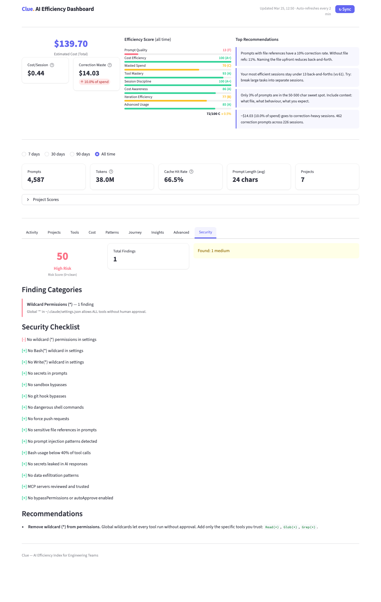

---

## Team Usage

```bash
# Each team member (on their machine):
./setup.sh
.venv/bin/python -m clue export --scrub --user-label "alice" -o alice.json

# Team lead merges:
.venv/bin/python -m clue merge alice.json bob.json carol.json -o team.json

# View merged dashboard:
# Copy team.json as data.json alongside index.html, or serve via dashboard command
```

**Privacy guarantees:**
- All data stays local — nothing sent anywhere
- `--scrub` removes all prompt text and project names from exports
- Dashboard JSON contains aggregated metrics only
- No absolute file paths in export
- No conversation content in export
- Security findings contain category + severity only, never the actual secret text

---

## Continuous Capture

`setup` installs a PostStop hook in `~/.claude/settings.json`:

```json
{
  "hooks": {
    "Stop": [
      {
        "hooks": [
          {
            "type": "command",
            "command": "/path/to/.venv/bin/python -m clue extract --incremental"
          }
        ]
      }
    ]
  }
}
```

After every Claude Code session ends, incremental extraction runs automatically. Your data stays current without manual intervention.

---

## Architecture

```
src/clue/
├── __init__.py         # Package version
├── __main__.py         # python -m clue entry
├── cli.py              # 7 commands: doctor, setup, extract, export, merge, score, dashboard
├── models.py           # Dataclasses: Prompt, TokenUsage, ConversationTurn, Session, EfficiencyScore
├── extractor.py        # Parses ~/.claude/ with incremental watermarks, cross-platform paths
├── db.py               # SQLite + WAL + versioned migrations + watermark table
├── patterns.py        # Shared regex patterns (scoring + security detection)
├── scorer.py           # 7+1 dimension scoring engine with semantic analysis + recommendations
├── export.py           # SQL queries → JSON with scores, security analysis, scrub mode, git correlation
├── git_utils.py        # Git log queries for session-outcome correlation (subprocess)
├── pipeline.py         # Extraction pipeline shared by CLI and dashboard
└── dashboard/
    └── app.py          # Streamlit dashboard with 9 tabs + live SQLite queries
```

Data flow:
```
~/.claude/ files
    ↓ extractor (watermarks for incremental)
SQLite (WAL mode, versioned schema)
    ↓ scorer (7+1 dimensions, weighted)
    ↓ export (SQL → JSON, security analysis, optional scrub + git correlation)
    ↓ git_utils (session → commit correlation via local git)
Streamlit + Plotly dashboard (9 tabs, live queries, auto-refresh)
```

---

## Data Sources

| Source | Location | Fields extracted |
|---|---|---|
| Prompt history | `~/.claude/history.jsonl` | timestamp, project, sessionId, text, char_length |
| Conversations | `~/.claude/projects/**/*.jsonl` | model, token usage (input/output/cache), tools, tool inputs (subagent_type, skill, run_in_background), cwd, gitBranch, version, stop_reason |
| Subagent logs | `~/.claude/projects/**/subagents/*.jsonl` | Same as conversations, flagged `is_subagent` |
| Session metadata | `~/.claude/sessions/*.json` | pid, sessionId, cwd, startedAt |
| Settings | `~/.claude/settings.json`, `.claude/settings.json` | Permissions allow/deny lists, MCP servers, bypass modes |
| CLAUDE.md | `./CLAUDE.md`, `~/.claude/CLAUDE.md` | Scanned for risky instructions (--no-verify, sandbox bypass, secrets) |

---

## Tests

```bash
task test           # or: .venv/bin/pytest tests/ -v
task test-unit      # Unit tests only
task test-integration # Integration + security tests
```

**232 tests** across 4 layers:

| Layer | Files | What it covers |
|---|---|---|
| **Unit** | `test_extractor.py`, `test_db.py`, `test_scorer.py`, `test_export.py` | Each module in isolation with mock data |
| **Integration** | `test_integration.py` | Full pipeline: mock files → extract → SQLite → export → JSON |
| **Security** | `test_integration.py::TestSecurityConstraints` | Prompt text never leaks, no absolute paths in exports |
| **CLI** | `test_cli.py` | All 7 commands including doctor, setup, merge, incremental extract |

---

## Cost Estimation

Approximate pricing based on public Anthropic rates:

| Model | Input | Output | Cache Write | Cache Read |
|---|---|---|---|---|
| Opus 4.6 | $5/M | $25/M | $6.25/M | $0.50/M |
| Sonnet 4.6 | $3/M | $15/M | $3.75/M | $0.30/M |
| Haiku 4.5 | $1/M | $5/M | $1.25/M | $0.10/M |

For details on how tokens are counted, costs are estimated, and known data limitations, see [docs/data-accuracy.md](docs/data-accuracy.md).

---

## License

MIT
